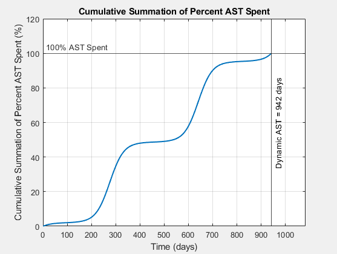
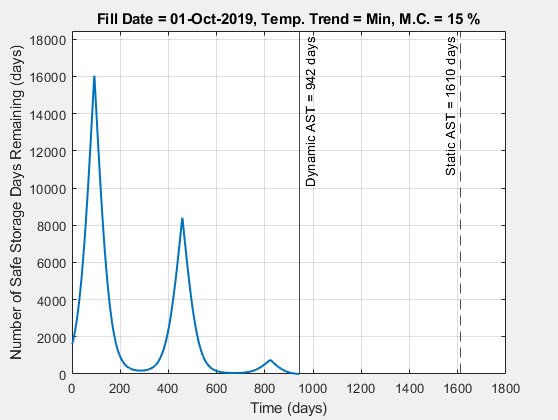

## _Introduction_

This repository serves as a storage location for a MATLAB function that supports the following research paper: **"Simulating the Influence of Temperature Variation on Allowable Storage Time of Shelled Corn"**.  This function is labeled "Dynamic_AST_Calculator.m", and it adds a level of automation to simulating dynamic allowable storage time (AST) and visualizing data.  This function is intended to be relatively straightforward and user-friendly.

## _How to use the Dynamic_AST_Calculator.m Function_

In order to utilize this function, only three inputs must be sequentially specified by the user: bin fill date, minimum or maximum temperature trend, and moisture content (% wet basis).  These three inputs are expressed as "Input_Date", "Input_Temp_Trend", and "Input_Moisture_Content" variables in the first line of the function.

Input_Date can be any date throughout the year, Input_Temp_Trend needs to be specified as either 'Min' or 'Max', and Input_Moisture_Content needs to be a numerical value.

## _Outputs of Function_

