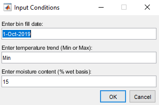
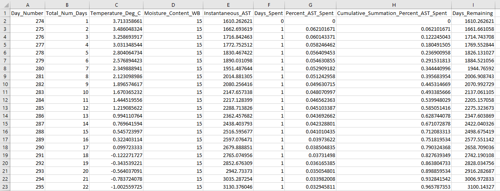

## _Introduction_

This repository serves as a storage location for a MATLAB function that supports the following research paper: **"Simulating the Influence of Temperature Variation on Allowable Storage Time of Shelled Corn"**.  This function is labeled "Dynamic_AST_Calculator.m", and it adds a level of automation to simulating dynamic allowable storage time (AST) and visualizing dynamic AST data through plots.  This function is intended to be relatively straightforward and user-friendly.

## _How to use the Dynamic_AST_Calculator.m Function_

There are two options for accessing this function:
   - For individuals that possess a MATLAB license and have the full MATLAB software installed: download the **Dynamic_AST_Calculator.m** file directly from this repository and load this script into your MATLAB environment.
   
   - For individuals that do not possess a MATLAB license: this same Dynamic_AST_Calculator.m function has also been transformed into an executable (.exe) file which is stored in a zip folder within this repository.  This executable file allows any user to easily click on the .exe file icon and have the function automatically execute in the background.  However, in order for this to work, you must download the corresponding 64-bit **R2018b** version of MATLAB Runtime.  MATLAB Runtime is completely free, and it allows anyone to "run compiled MATLAB applications or components without installing MATLAB."  The MATLAB Runtime download link can be found here: https://www.mathworks.com/products/compiler/matlab-runtime.html.

Once this function is executed, an input text box will automatically generate and will require the user to specify three sequential inputs: bin fill date, minimum or maximum temperature trend, and moisture content (% wet basis). 
 
   - **Bin fill date** can be any date throughout the year
   - **Temperature trend** can be entered as either 'Min' or 'Max'
   - **Moisture content** needs to be specified as a numeric variable and can be any reasonable shelled corn moisture content (% wet basis)

These inputs need to be **correctly formatted** in order for the function to run without errors.  The proper format is depicted in the default values of the input box example shown below:

The proper abbreviations for a given month are as follows: Jan, Feb, Mar, Apr, May, Jun, Jul, Aug, Sep, Oct, Nov, & Dec.

If the specified temperature trend and moisture content inputs are valid, then acceptance messages will automatically display at the command line as the function is simulating the dynamic AST response.

## _Outputs of Function_

Each time this function is executed, it outputs a summary excel file of important dynamic AST data to the local file directory.  This summary excel file will have the corresponding inputs associated with it in the file name.  This function also outputs two separate figures.  The first figure depicts the cumulative summation of percent AST spent.  The second figure depicts how the number of safe storage days remaining is altered as a function of time, which eventually results in a single dynamic AST value.

**Figure 1 Example Output**

**Figure 2 Example Output**

**Excel File Example Output**

## _Conclusion_

This function helps understand how dynamic AST is altered through three inputs: bin fill date, minimum or maximum temperature trend, and moisture content (% wet basis).  By experimenting with these variables, any user can simulate different scenarios and analyze how each input transforms the dynamic AST response.
